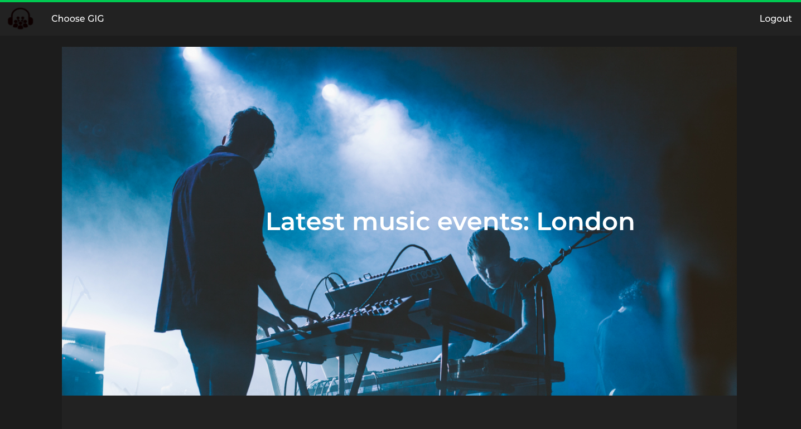
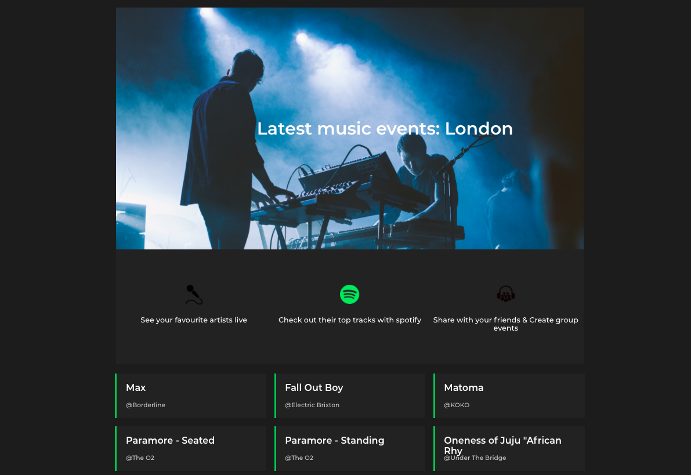
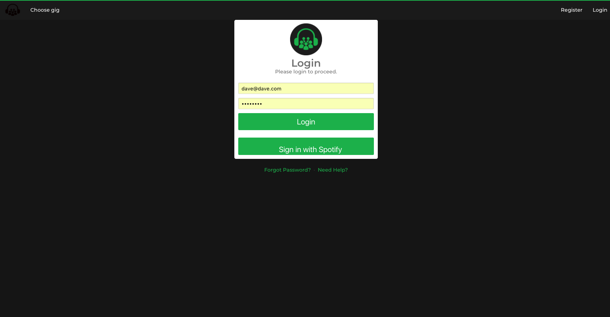
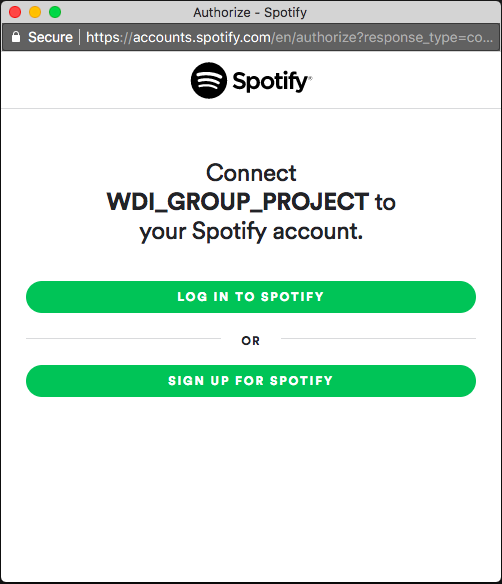
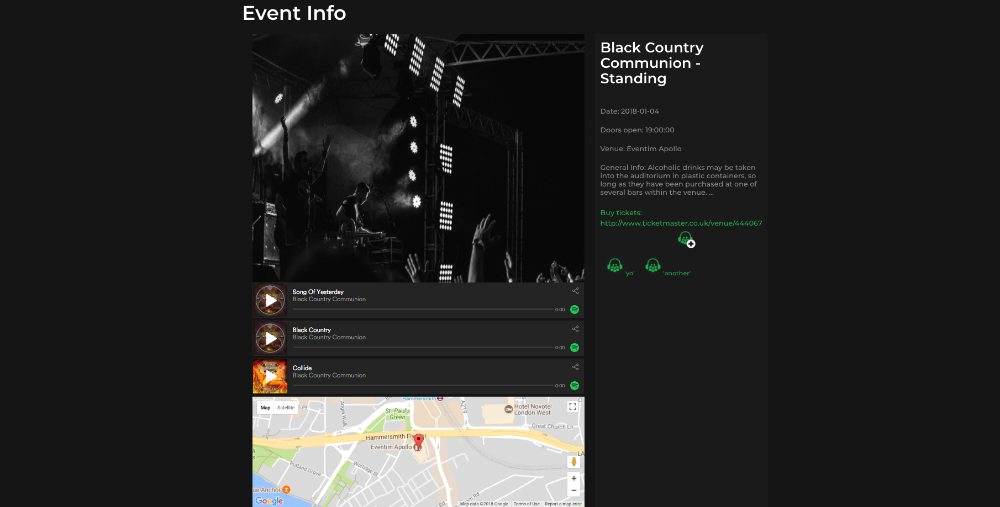
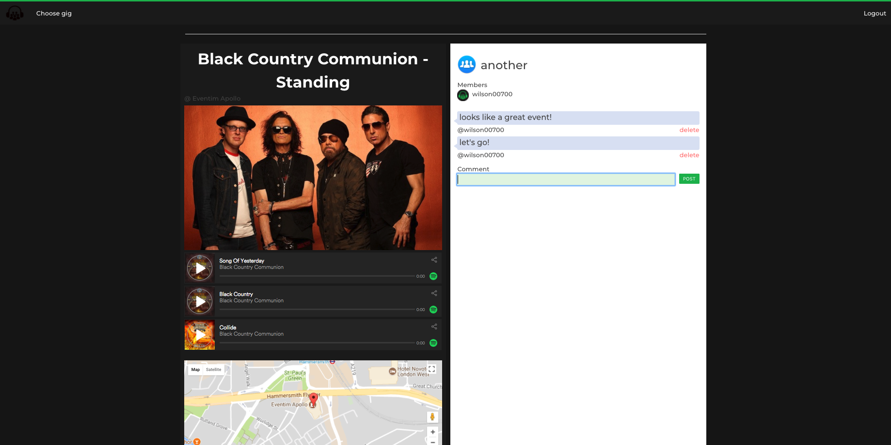

# WDI_GROUP_PROJECT - MEAN Stack App - 'Gig.ly'

## Summary

* Index Page - lists London's latest live music events.

* The user can login with Spotify to hear the artists top tracks using the Spotify player.

* More information on the event, location and the bands top tracks can be found on the show page.

* The user can create a group chat for people attending the upcoming gig.

This is a social music event app designed for people to chat within groups attending upcoming gigs. The app showcases London’s latest music events and allows the user to easily create group events, listen to artists top tracks on a Spotify player and message other attendees.

This was a team project that involved using Github collaboratively to produce a RESTful app. My main responsibility for the project was to integrate the Ticketmaster and Spotify API’s. I used AJAX to make requests to Ticketmaster get information on upcoming music events, then used Spotify for the artists top tracks.  

## Technologies Used

* Programming and Technology Library:
* Mongo, Express, AngularJS, Node.js
* HTML5
* CSS3
* SASS / SCSS
* Bulma
* Mocha
* Chai
* Gulp
* TicketMaster API
* Google Maps API
* Spotify API

